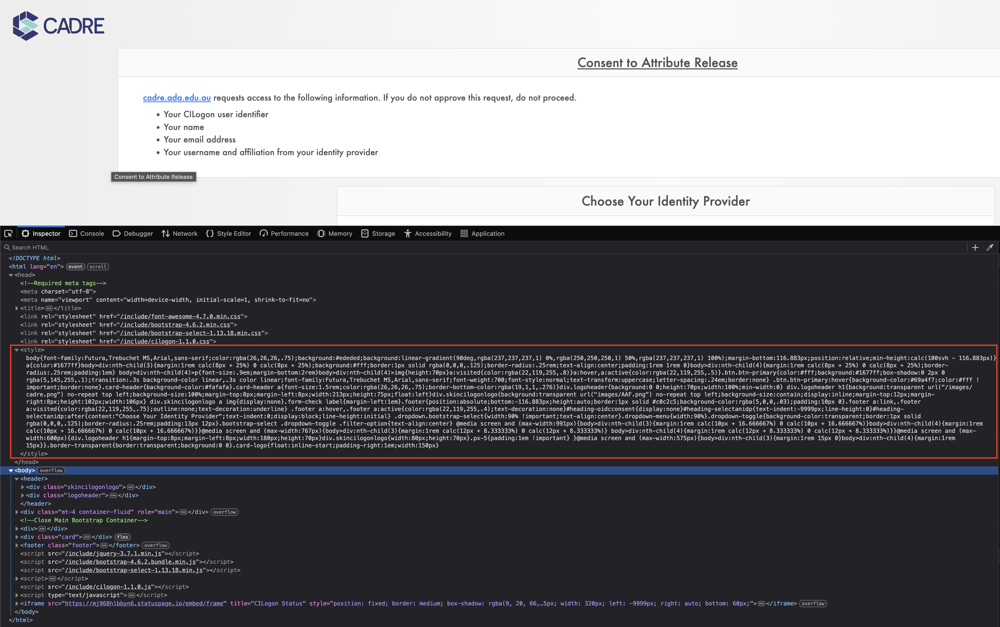

# Coordinated Access for Data, Researchers and Environments (CADRE) Skin

> This repository stores the `CSS` file which is applied to CADRE's authentication page.

For users to log into CADRE, they are navigated to the `https://cilogon.aaf.edu.au/authorize` login page to select their identity provider and then progress to authenticate themselves using said identifity provider. The stylesheet within this repository is used to style the aforementioned page with CADRE branding and aesthetics.

> [!NOTE]
> Both Australian Access Federation (AAF) and CiLogon refer to this method of applying stylesheets to the login page as **'skinning'** and the stylesheet itself as the **'skin'**.

## How does the skin get applied?

A copy of the CADRE skin's styling is saved within each CiLogon instance which is then referred to and applied to CADRE's login pages. The skin's styling information is dynamically inserted into the `<head>` element of the page and which then applies CADRE's branding. To determine which skin CiLogon should use when dynamically inserting the styling into the page, a combination of both the `skin` and the `clientid` query parameters are used. CiLogon can associate a skin to a certain [CO](https://spaces.at.internet2.edu/spaces/COmanage/pages/10732/Home), so in CADRE's case, the skin will be automatically applied when a user is navigated to login using a `clientid` that is associated with CADRE's CO. Otherwise, if a skin is not associated with a CO, the `skin` query parameter defines which skin to utilise. In the case of CADRE, our skin can be set using the string 'cadre'. Within the URL, this'll look like: `https://cilogon.aaf.edu.au?skin=cadre`

> [!TIP]
> The sequence of priority goes:
> 
> 1. Skin associated with the `clientid` query parameter
> 2. Assignment with the `skin` query parameter
> 3. Cached page CSS

As can be seen from the screenshot below, when inspecting the HTML of the page we can see the `<style>` tag where the CADRE skin is being inserted.

## Updating the skin

As previously mentioned, a copy of the CADRE skin is saved within each CiLogon instance. For this reason, when seeking to update a skin on dev, test, or production a member of the AAF or CiLogon team should be notified about the changes made. They will then proceed to update the instances with the desired changes by downloading the latest commit of the stylesheet within this repository. Typically, the changes are first tested on dev and test before being updated on production. This effort requires communication between the CADRE and CiLogon teams to ensure that the skin is working to brand the page to our liking.

## Development & Testing Changes

The best method for testing is to copy the CSS file's content with the desired changes and to paste the updated CSS in the `<style>` tag within the `<head>` tag in your browser. This is sufficient when trialling small changes but it can quickly become tedious when creating sweeping changes. If you find this to be the case, you can also host the file locally and link out to your locally hosted external stylesheet. This can make it far quicker to make changes and have them reflect live on the website.

When developing changes, the skin's styling must be checked to work correctly on the following pages:

- https://dev.cilogon.aaf.edu.au/?skin=cadre
- https://dev.cilogon.aaf.edu.au/me/?skin=cadre
- https://dev.cilogon.aaf.edu.au/device/?skin=cadre
- https://dev.cilogon.aaf.edu.au/authorize?scope=org.cilogon.userinfo+openid+profile+email&response_type=code&redirect_uri=https%3A%2F%2Fdemo-dev.cilogon.aaf.edu.au%2Fcilogon2%2Fready&prompt=login&client_id=cilogon%3Adev.cilogon.aaf.edu.au%2Fdemo&skin=cadre

If the styling is working correctly and there are no styling errors or design faults, then it the repository should be updated with the equivalent changes and the CiLogon/AAF team should be notified to update the skin. 